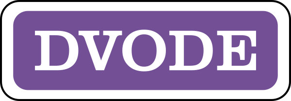

============

Modern Fortran Edition of the DVODE ODE Solver.

**THIS IS A WORK IN PROGRESS!**

[](https://github.com/jacobwilliams/dvode/releases/latest)
[](https://github.com/jacobwilliams/dvode/actions)
[](https://codecov.io/gh/jacobwilliams/dvode)


### Documentation
The latest API documentation can be found [here](https://jacobwilliams.github.io/dvode/). This was generated from the source code using [FORD](https://github.com/Fortran-FOSS-Programmers/ford) (i.e. by running `ford ford.md`).

### Compiling

The library can be compiled with recent versions the Intel Fortran Compiler and GFortran (and presumably any other Fortran compiler that supports modern standards).

A `fmp.toml` file is provided for compiling dvode with the [Fortran Package Manager](https://github.com/fortran-lang/fpm). For example, to build:

```
fpm build --profile release
```

By default, the library is built with double precision (`real64`) real values. Explicitly specifying the real kind can be done using the following processor flags:

Preprocessor flag | Kind  | Number of bytes
----------------- | ----- | ---------------
`REAL32`  | `real(kind=real32)`  | 4
`REAL64`  | `real(kind=real64)`  | 8
`REAL128` | `real(kind=real128)` | 16

For example, to build a single precision version of the library, use:

```
fpm build --profile release --flag "-DREAL32"
```

To run the unit tests:

```
fpm test --profile release
```

To use `dvode` within your fpm project, add the following to your `fpm.toml` file:
```toml
[dependencies]
dvode = { git="https://github.com/jacobwilliams/dvode.git" }
```

or, to use a specific version:
```toml
[dependencies]
dvode = { git="https://github.com/jacobwilliams/dvode.git", tag = "1.0.0"  }
```

The library requires some [BLAS](https://netlib.org/blas/) routines, which are included. However, the user may also choose to link to an external BLAS library. This can be done by using the `HAS_BLAS` compiler directive. For example:

```
fpm build --compiler gfortran --flag "-DHAS_BLAS -lblas"
```

However, note that an external BLAS can only be used if the library is compiled with double precision (`real64`) reals.

### References
 * Brown, Byrne, Hindmarsh, [VODE, A Variable-Coefficient ODE Solver](https://computing.llnl.gov/sites/default/files/ODEPACK_pub4_207532.pdf), June 1988.
 * [ODEPACK](https://computing.llnl.gov/projects/odepack): Fortran ODE Solvers [LLNL]

### See also
 * [SUNDIALS](https://computing.llnl.gov/projects/sundials) The successor to VODE and other codes from LLNL. [(GitHub repo)](https://github.com/LLNL/sundials)
 * A backup of another DVODE refactoring formerly located at  https://www.radford.edu/~thompson/vodef90web/vodef90source/misc.html can be found at [CRquantum/dvode_backup](https://gitlab.com/CRquantum/dvode_backup).
 * [DDEABM](https://github.com/jacobwilliams/ddeabm) Modern Fortran implementation of the DDEABM Adams-Bashforth algorithm.